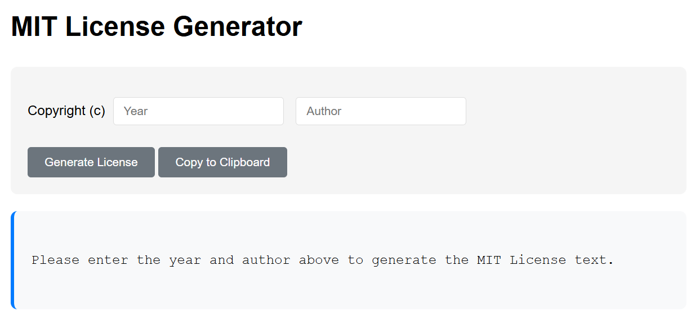

# MIT License Generator (HTML5, Python, Ruby)



## Description
This project is a simple, cross-platform MIT License text generator available in HTML5, Python, and Ruby. The core features of the project include:

- **Multi-language support**: Available in HTML5, Python, and Ruby
- **User-friendly interface**: Intuitive input fields and clear instructions
- **Real-time validation**: Ensures valid year (4 digits) and author name
- **Copy to clipboard**: Easily copy generated licenses to your clipboard
- **Responsive design**: Works well on most different screen sizes

## Installation
```bash
git clone https://github.com/Pac-Dessert1436/mit-license-generator.git
cd mit-license-generator
```

### For HTML5 Version

1. No installation required!
2. Simply open `MIT_Generator.html` in any modern web browser.

### For Python Version

1. Ensure you have Python 3.6 or higher installed
2. No additional dependencies required (uses standard library `tkinter`)

### For Ruby Version

1. Ensure you have Ruby 3.0 or higher installed
2. Install the required gems:
```bash
gem install ruby2d
gem install clipboard
gem install ffi
```

## Usage

### HTML5 Version

1. Open `MIT_Generator.html` in your web browser
2. Enter a 4-digit year (e.g., 2026)
3. Enter the author name(s) or organization
4. Click "Generate License" or press `Ctrl+Enter`
5. Click "Copy to Clipboard" to copy the license text

### Python Version

1. Run the script:
```bash
python mit_generator.py
```
2. Enter a 4-digit year in the first input field
3. Enter the author name(s) in the second input field
4. Click "Generate License" or press `Ctrl+Enter`
5. Click "Copy to Clipboard" to copy the license text

### Ruby Version

1. Run the script:
```bash
ruby mit_generator.rb
```
2. Enter a 4-digit year in the first input field
3. Enter the author name(s) in the second input field
4. Click "Generate License" to generate the license text
5. Click "Copy to Clipboard" to copy the license text

## Files Included
- `MIT_Generator.html`: HTML5 version with CSS and JavaScript
- `mit_generator.py`: Python version using tkinter
- `mit_generator.rb`: Ruby version using Ruby2D
- `LICENSE`: MIT License for this project
- `README.md`: This documentation file

## Contributing
Contributions are welcome! Please feel free to submit a Pull Request.

## Acknowledgments
- The MIT License text is based on the official MIT License template
- Ruby2D library for the Ruby version's GUI
- Tkinter library for the Python version's GUI

## License
This project is licensed under the MIT License. See the [LICENSE](LICENSE) file for details.